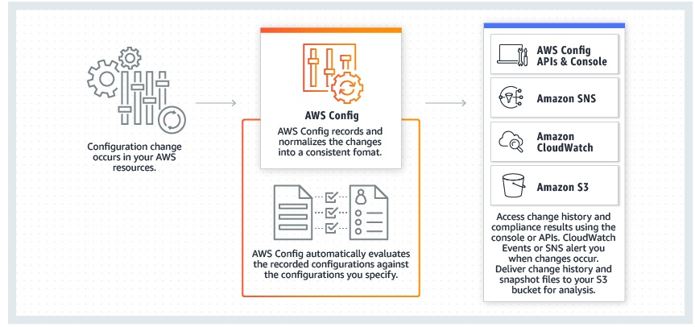

# Notes - Post Linux Academy Challenge


Topics

* Incident response plans - be clear on the goals of frequently testing and simulating incident response plans
* What do you do after creating a new account to avoid issues with root credentials?
    * IAM best practices describes [locking away root user keys](https://docs.aws.amazon.com/IAM/latest/UserGuide/best-practices.html#lock-away-credentials) - protect the password, use MFA, delete access keys, use strong password, etc
* Understand AWS Config and its before and after capabilities, including IAM permissions.
* Compromised EC2 instance - what to do?
* Keys in a public repo - what to do?
    * See [this blog post](https://aws.amazon.com/blogs/security/what-to-do-if-you-inadvertently-expose-an-aws-access-key/)
* Default encryption on s3 objects
* AWS Config Rules - check for things like logging enabled on all buckets
    * Two types - predefined and custom
* Review bucket policies, bucket ACLs, and use cases - including bucket policies for unauthenticated users.
    * See [this](https://aws.amazon.com/blogs/security/iam-policies-and-bucket-policies-and-acls-oh-my-controlling-access-to-s3-resources/) blog post.
* Review basic capabilities of security related services
* Create a private, isolated s3 bucket
* Enforce requirement that all objects upload to s3 use SSE-S3 using AWS_256
* Long term credentials for service accounts - IAM user
* KMS API operations include re-encrypt
* Key rotation details for KMS
* FIPS levels for KMS, CloudHSM
* CMK resource policy
* KMS throttling errors, encryption SDK key caching
* CloudHSM JCE compatibility
* Know the distinction of CMKs and DEKs and what KMS can manage and generate.

## Notes

### Policies

See [here](https://docs.aws.amazon.com/IAM/latest/UserGuide/introduction_access-management.html)

*Identity-based* policies control what actions the identity can perform, on what resources, and under what conditions. These are permissions policies you attach to an IAM identity such as a user, group, or role.

* Managed and inline variants.

*Resource-based policies* control what actions a specified principal can perform on that resource and under what conditions. These are permissions policies you attach to a resource such as an S3 bucket or an IAM role trust policy.

* Inline only
* To enable cross account access, you can specify an entire account or IAM entities in another account as the principal in a resource based policy.

> The IAM service supports only one type of resource-based policy called a role trust policy, which is attached to an IAM role. Because an IAM role is both an identity and a resource that supports resource-based policies, you must attach both a trust policy and an identity-based policy to an IAM role. Trust policies define which principal entities (accounts, users, roles, and federated users) can assume the role. 

Some services that support resource based policies

* S3 buckets
* SNS topics
* SQS queues

Delegating AWS Permissions in a Resource-based policy

* After a resource grants your AWS account permissions as a principal in its resource based policy, you can then delegate permissions to specific users or groups under your AWS accounts.
* You can delegate a subset of the original permissions granted, but not more.

### AWS Config - Before and After

* Continuously monitor and record configuration changes of AWS resources
* Send notifications if config has changed via SNS, can fire lambdas from that, etc.
* Review history of config states
* Combine with CloudTrail to identify root causes of operational problems
* Mutli-account, multi-region data aggregation




### S3 Encryption

Can use a policy to require server-side encryption:

```console
{
   "Version":"2012-10-17",
   "Id":"PutObjPolicy",
   "Statement":[{
         "Sid":"DenyUnEncryptedObjectUploads",
         "Effect":"Deny",
         "Principal":"*",
         "Action":"s3:PutObject",
         "Resource":"arn:aws:s3:::YourBucket/*",
         "Condition":{
            "StringNotEquals":{
               "s3:x-amz-server-side-encryption":"aws:kms"
            }
         }
      }
   ]
}
```

Can also use condition key of `s3:x-amz-server-side-encryption-aws-kms-key-id `