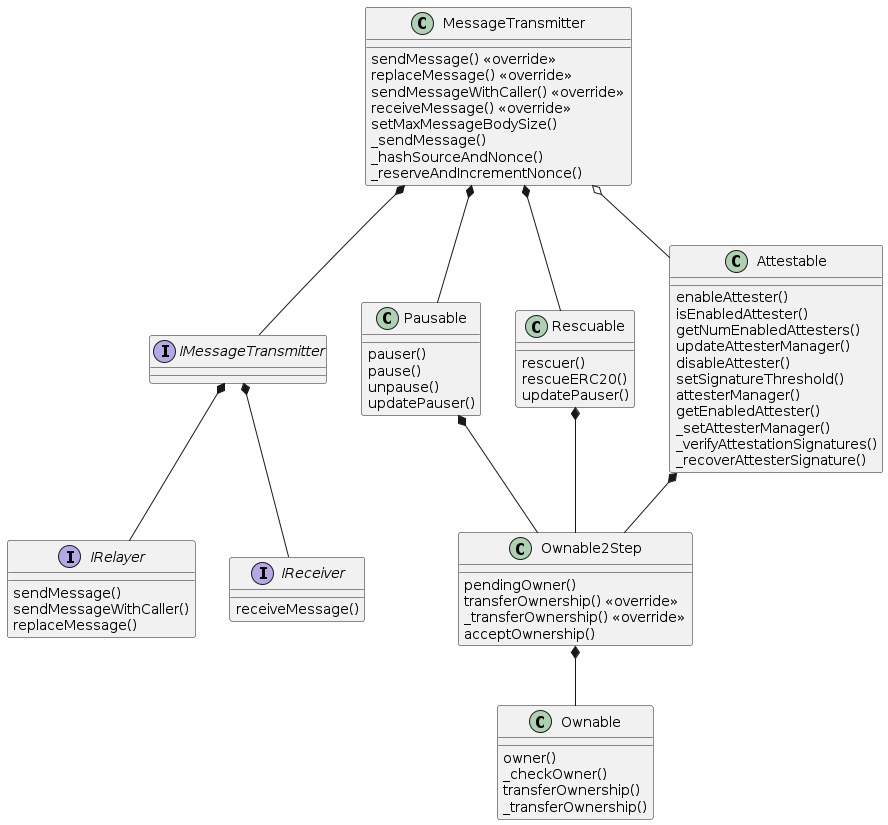
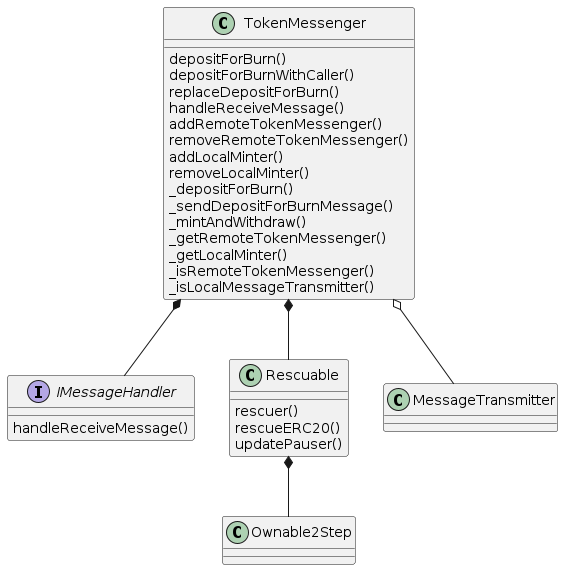
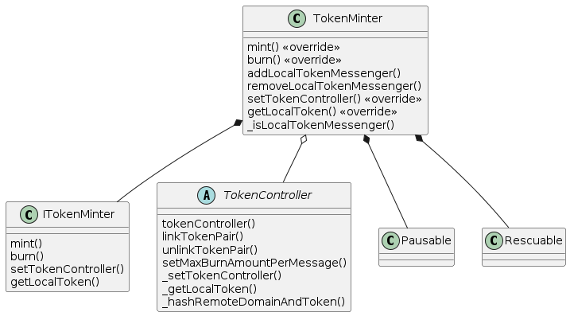

# CCTP Notes

Circle - https://www.circle.com/en/cross-chain-transfer-protocol

Developer docs - https://developers.circle.com/stablecoins/docs/cctp-getting-started

Bridges - https://ethereum.org/en/developers/docs/bridges/#how-do-bridges-work

* lock and mint -  Lock assets on the source chain and mint assets on the destination chain.

Contracts

* TokenMessenger: Entrypoint for cross-chain USDC transfer. Routes messages to burn USDC on a source chain, and mint USDC on a destination chain.
* MessageTransmitter: Generic message passing. Sends all messages on the source chain, and receives all messages on the destination chain.
* TokenMinter: Responsible for minting and burning USDC. Contains chain-specific settings used by burners and minters.

(Descriptions taken from circle docs)

Roles

* Attestable - an ownable 2 step use to manage attestation config, plus some logic to check if a message is attested
* Ownable - Forked from open zeppelin
* Ownable2Step - forked from open zeppelin, allows transfer of ownership post deployment
* Pausable
* Rescuable
* TokenController - not really a role, but an abstract contract used to link tokens across domains

Open Zeppelin Acess Control - see https://docs.openzeppelin.com/contracts/2.x/access-control

* Ownable - most basic form of access control: a contract has an owner can can do administrative stuff on it
* Ownable2Step - transfer of ownership requires acceptance by the new owner

## MessageTransmitter

## TokenMessenger

## TokenMinter

