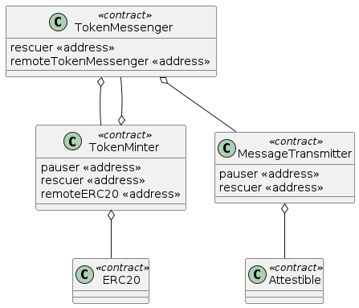

# CCTP Notes

Circle - https://www.circle.com/en/cross-chain-transfer-protocol

Developer docs - https://developers.circle.com/stablecoins/docs/cctp-getting-started

Bridges - https://ethereum.org/en/developers/docs/bridges/#how-do-bridges-work

* lock and mint -  Lock assets on the source chain and mint assets on the destination chain.

Contracts

* TokenMessenger: Entrypoint for cross-chain USDC transfer. Routes messages to burn USDC on a source chain, and mint USDC on a destination chain.
* MessageTransmitter: Generic message passing. Sends all messages on the source chain, and receives all messages on the destination chain.
* TokenMinter: Responsible for minting and burning USDC. Contains chain-specific settings used by burners and minters.

(Descriptions taken from circle docs)

Roles

* Attestable - an ownable 2 step use to manage attestation config, plus some logic to check if a message is attested
* Ownable - Forked from open zeppelin
* Ownable2Step - forked from open zeppelin, allows transfer of ownership post deployment
* Pausable
* Rescuable
* TokenController - not really a role, but an abstract contract used to link tokens across domains

Open Zeppelin Acess Control - see https://docs.openzeppelin.com/contracts/2.x/access-control

* Ownable - most basic form of access control: a contract has an owner can can do administrative stuff on it
* Ownable2Step - transfer of ownership requires acceptance by the new owner

## MessageTransmitter

## TokenMessenger

## TokenMinter

## Deployment

1. Deploy the MessageTransmitter contract

    * Add pauser
    * Add rescuer

Note the attestable address must be known at deployment time. This is set from the ATTESTER_ADDRESS environment variable.

2. Deploy TokenMessenger contract

   * Uses address from deployment of MessageTransmitter

    * Add rescuer

3. Deploy TokenMinter contract

    * Uses address from deployment of TokenMessenger as the token controller argument

    * Token controller address comes from environment

    * Add local token messenger 

    * Update pauser

    * Update rescuer

4. Add minter address to token messenger

5. Link token pair

    * This links the token pair contract address with the remote address and remote domain
    * In the deployment script the max burn amount per message is also set

6. Add remote token messenger to token minter

Note contract addresses can be [precomputed](https://ethereum.stackexchange.com/questions/760/how-is-the-address-of-an-ethereum-contract-computed).

Based on the above, it should be possible to reuse the CCTP contracts with any token that can fit the
CCTP contracts.

### Deployment Illustrated

Environment variables

    - `MESSAGE_TRANSMITTER_DEPLOYER_KEY`
    - `TOKEN_MESSENGER_DEPLOYER_KEY`
    - `TOKEN_MINTER_DEPLOYER_KEY`
    - `TOKEN_CONTROLLER_DEPLOYER_KEY`
    - `ATTESTER_ADDRESS`
    - `USDC_CONTRACT_ADDRESS`
    - `REMOTE_USDC_CONTRACT_ADDRESS`
    - `MESSAGE_TRANSMITTER_PAUSER_ADDRESS`
    - `TOKEN_MINTER_PAUSER_ADDRESS`
    - `MESSAGE_TRANSMITTER_RESCUER_ADDRESS`
    - `TOKEN_MESSENGER_RESCUER_ADDRESS`
    - `TOKEN_MINTER_RESCUER_ADDRESS`
    - `TOKEN_CONTROLLER_ADDRESS`
    - `DOMAIN`
    - `REMOTE_DOMAIN`
    - `BURN_LIMIT_PER_MESSAGE`

The USDC contract addresses must be known. But... what about the token controller address?

- Token controller is at https://etherscan.io/address/0x8a9A13A106cB89E15410B2AB4488135155032169
- On-chain this is an EOA, not an address.
- This represents the address who can access functions gated by the `onlyTokenController` modifier.

For the attester:

- Sourced using the `ATTESTER_ADDRESS` environment variable
- The MessageTransmitter is at https://etherscan.io/address/0x0a992d191deec32afe36203ad87d7d289a738f81
- The Attester abstract Solidity contract is constructed with an EOA address, which is used to guard method calls using the `onlyAttesterManager` modifier.
- The address passed to the constructor is used to initalize the attesterManager variable.

