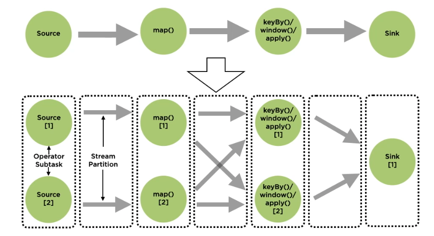
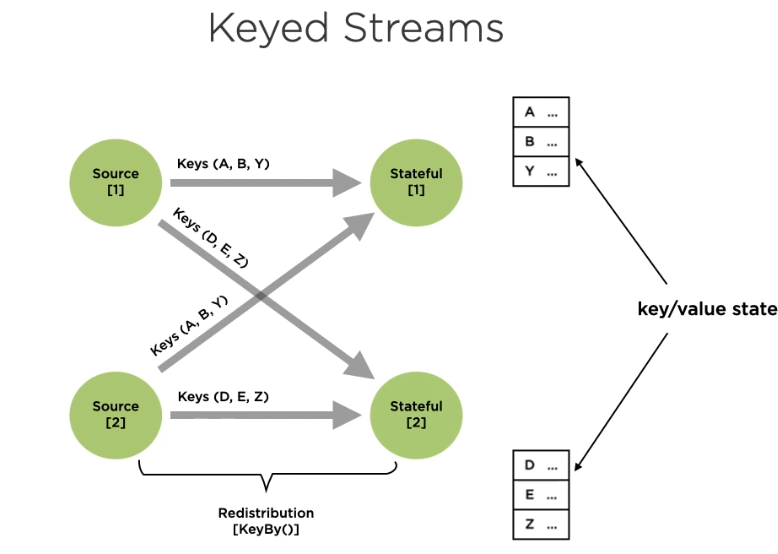

# Notes from Conceptualizing the Processing Model for Apache Flink

## Batch and Stream Processing

* Flink can handle both - bounded vs unbounded.
* Collect, analyze, extract - batch
* Monitor, process, extract - streaming

Batch

* Bounded data
* Processes in batches
* High latency ok
* Periodic updates as jobs complete
* Data order unimportant
* single global state of the world
* processing code "knows" all the data

Streaming

* unbounded data
* processed continuously, as data is receieved
* low latencies
* continuous updates
* Ordering important, out of order arrival tracked
* No global state, only history of events received
* Processing code does not know what lies ahead

## Stream Processing

* Data is received as a stream
* Continuously processed - process individual messages, patterns of messages

Basic Architecture

* Source data streamed into message transport
* Stream processing reads from message transport

Message Transport

* Buffer for event data 
* Performant and persistent
* Decouple multiple sources from processing of the streaming data

Examples: Kafka, MapR stream

Stream Processing

* high throughput, low lateny
* fault toleerance with low overhead
* managed out of order events
* easy to use, maintainable
* replay streams

data sources -> transformations -> sink

Directed acylic graph

## Apache Flink

* Open source, unified stream-processing framework for batch and streaming apps
* Unbounded streams, not micro-batches
* Stream dataflows in flink are transformed by user-defined operators
* Nodes in the graph represent operators

Flink applications

* User defined operators
* Streaming data flow
* Flink programs are inherently parallel and distributed 
* Streams are composed of stream partitions
* Operators are composed of operator subtasks



* Number of subtasks refer to the parallelism of the operator
* Edges in graph - streams
* Forwarding (one to one) Pattern
* Redistributing Pattern - each operator subtask sends data to different target subtasks

## Environment Set Up

1.11.1 - Flink version used for the course

* Java and mvn prerequisites
* Download flink 1.11.x for scala
* Project dir - ApacheFlink/code/datasets ApacheFlink/code/output - put flink download in ApacheFlink and untar there
* Add a FLINK_HOME env var to .bash_profile

## Stream Transformations

* Stateless - transformations that are applied on a single stream entity
    * map, flatMap, filter
* Stateful - transformations which acumulate across multiple stream entities
    * assumulate data across a longer time interval - entire stream, window, per key, per operator

## Flink Architecture

* Flink application - any program that spawns a flink job
* Execution of a flink job can be
    * local jvm
    * remote cluster
        * job manager
        * task managers

Job Manager

* Coordinates the distributed execution of flink applications
* schedules tasks, manages failures
* Coordinate checkpoints and recovery
* Recieves JobGraph (DAG of operators and intermediate results), transforms to execution graph
* Execution graph is parallelized

Job Manager Components

* ResourceManager
    * Allocation, deallocation, and provisioning of cluster
    * Manages task slots
* Dispatcher
    * REST interface to submit applications
    * Runs flink webui
* JobMaster
    * Managed execution of a single job

TaskManagers 

* One of more TaskManagers (workers) execute the tasks of the dataflow
* Buffer and exchange data streams
* Use units of scheduling called task slots

Task Slots

* Represent a fixed subset of resources of a task manager
* Smallest unit of resource scheduling
* Number of task slots indicate concurrent processing tasks
* Multiple operators can work within the same slot

Task

* Basic unit of execution
* Where each parallel instance of an operator is execute

Executing and Monitoring Streaming Queries

* Start the cluster - `*$FLINK_HOME/bin/start-cluster.sh`
* Go localhost:8081
* Submit a sample

```
$FLINK_HOME/bin/start-cluster.sh

$FLINK_HOME/bin/flink run $FLINK_HOME/examples/streaming/WordCount.jar \
--input /Volumes/seagate/ApacheFlink/code/datasets/words.txt \
--output /Volumes/seagate/ApacheFlink/code/datasets/output/wordcount.txt

$FLINK_HOME/bin/stop-cluster.sh
```

## Configuration Settings 

See flink.yml in conf/

```
$FLINK_HOME/bin/flink run $FLINK_HOME/examples/streaming/TopSpeedWindowing.jar

tail -f $FLINK_HOME/log/flink-*-taskexecutor-*.out

$FLINK_HOME/bin/flink list -m 127.0.0.1:8081
```

Example - change number of task slots from 1 to 4, parallelism default from 1 to 2, set rest.port frpm 8081 to 8088

```
$FLINK_HOME/bin/flink run -p 3 $FLINK_HOME/examples/streaming/TopSpeedWindowing.jar 
```


## Flink Project Set Up

mvn archetype:generate                               \
  -DarchetypeGroupId=org.apache.flink              \
  -DarchetypeArtifactId=flink-quickstart-java      \
  -DarchetypeVersion=1.11.1 \
  -DgroupId=my-flink-project \
  -DartifactId=my-flink-project \
  -Dversion=1.0-SNAPSHOT \
  -Dpackage=ds.org.helloflink \
  -DinteractiveMode=false

In IntelliJ, to run our program, we add the contents of the $FLINK_HOME/lib as module dependencies to the project via File > ProjectSTructure > Modules > Dependencies > Plus

To run HighSpeedDetection, start nc -l 9000, then the app. In nc submit a line at a time with car name and speed, e.g. Toyota, 67

netstat -ant -p TCP|grep LISTEN

## Deployment

Flink app - any program that spawns a flink job

Types of clusters

* Session cluster 
    * aka flink cluster in session mode
    * interactive use-cases with short running queries, want savings on resource spin up
    * life cycle
        * pre-existing, long running cluster
        * can accept multiple job submissions
        * remains alive after jobs finished
    * resource isolation
        * jobs compete for resources
        * crash in job manager or task manager affects all jobs

* Job cluster
    * aka flink cluster in job mode
    * use cases with high need for stability (long running jobs, cluster startup time matters less)
    *  Cluster created for a particular job
    * life cycle
        * spun up by cluster manager (yarn, kubernetes, etc)
    * resource isolation
        * jobs do not compete for resources
        * crash in job manager or task manager affects only one job

* Application cluster
    * Life cycle: dedicated cluster for one application only
        * main runs on cluster not on client
        * lifetime tied to the application
    * resource isolation: best separation of concerns
        * resource manager and dispatcher scoped to on appiliation only

Modes of Flink Deployment

* Session mode - deploy to an existing cluster, jobs compete for resources
* Per-job Mode - better isolation, spin up a cluster per job
* Application mode - long running cluster dedicated to the app, main runs on the JobManager of the cluster

Deployment Targets

* Local
* Standalone
* Yarn
* Docker
* Kubernetes
* Mesos

## Job Manager High Availability

* Typically one JobManager per cluster
* If Job Mnager crashes no additional programs can be submitted, running programs will fail

Stand ALone Cluster

* Can run multiple JobManagers, single leader, stand by job managers
* No explicit distinction between stand bys and leader
* Leader election for new leader after JobManager leader crashes
* Uses ZooKeeper for leader election

HA with YARN

* Single master needed, YARN will restart a leader on failure

For the deployment demo, add in a transformer entry in pom.xml, e.g.

```
<transformers>
    <transformer implementation="org.apache.maven.plugins.shade.resource.ManifestResourceTransformer">
        <mainClass>ds.org.helloflink.LifeExpectancyTracking</mainClass>
    </transformer>
</transformers>
```

The in IntelliJ, project settings > artifacts > + > jar >  jar from modules with dependencies > Main class > select

Build > Build artifacts > build

## Performing Stateless Transformations on Streams

* filter
* map
* flatMap

Datastream, Dataset, Table APIs, SQL queries

xforms

* stateless transformation - processing a single entity at a time

DataStreams support Pojos under certain conditions

$FLINK_HOME/bin/flink run -c ds.org.helloflink.SentenceSplitting out/artifacts/my_flink_project_jar/my-flink-project.jar

Stateful Stream Processing API

* timeles stream processing
* stateful stream processing
* fault tolerant state

Datastream / Dataset APIs - core APIs to use unbounded and bounded data

* Common building blocks for data processing
    * user specified transformations
    * joins
    * aggregations
    * windowing

Table API 

* Centered around tables - streams and batch
* Follows the relational model
* select, project, join, group by, aggregate

SQL - highest level abstraction

* Similar to the table API in semantics and expressiveness
* Represent programs as SQL query expresstions
* Execute over tables defined using the table api

## Keyed Streams

Associated each record in the stream with a key, for example a course score associated with a student name.

* All entities with the same key is sent to the same process
* KeyedStream - keys are virtual, used to virtually partition a stream
* Key - keyBy takes a key specifyer
* Partition a single stream into multiple independent streams

Keyed streams

* Flink will partition a single stream into multiple independent streams
* Each stream will hold elements that have the same key
* Stateful operations will only have access to elements with the same state.




## Stateful Transformations

Accumulate information across entities in a stream

* Operator State - maintaining state on a per-operator basis on streams
    * Associated with source and sink, not typically used
    * Also used in scenarios where you do not have a key to partition state
* Keyed State - maintaining state on a per-key basis

Broadcast State

* Special type of operator state
* Records of one stream will be broadcast to all downstream tasks
* State can be accessed while processing records of a second stream

Keyed Stated

* Used with KeyedStream
* Stores state across all elements assocaited with the same key
* Queryable State - feature that allows client APIs to query state from outside Flink

## Keyed State Interaces

* ValueState<T> - holds a value of any type
* ListState<T> - hold a list of elements
* ReducingState<T> - holds a single value, result of an aggregation over input elements, value is the reult of an aggregation over input elements, elements added to the reduced to the aggregate
* AggregatingState<T> - holds a single value of any type, value is the reult of an aggregation over input elements, value can be a different type from the input elements, elements added to the state are reduced to the aggregate
* MapState<UK,UV> - keeps a list of mappings from key to value

Accessing State

* State objects are used to interface with state
* Actual state can be stored externally
* Use state descriptos to get access to state handles
* State is access using the RuntimeContext
* Runtime is accessible via RichFunctions

Rich Functions

* All transformations on data can be represented using rich functions
* Provide additional methods for 
    * parameterizing the function
    * managing state
    * accessing runtime information
    * accessing broadcast variables

Fault Tolerance

* Persist state of flink program
    * replay - resend records from a source so they can be processed again
    * checkpointing - marks points in input streams and state of operators, restart from checkpoint
        * diabled by default, if enable default persistence is internal

* MemoryStateBackend - memory
* FsStateBackend - files
* RocksDBStateBackend


Joins Notes

* https://ci.apache.org/projects/flink/flink-docs-release-1.13/docs/dev/datastream/operators/joining/
* https://blog.knoldus.com/flink-join-two-data-streams/

## Table API

Additional dependencies

```
<dependency>
			<groupId>org.apache.flink</groupId>
			<artifactId>flink-table-api-java-bridge_${scala.binary.version}</artifactId>
			<version>1.11.1</version>
		</dependency>

		<dependency>
			<groupId>org.apache.flink</groupId>
			<artifactId>flink-table-planner-blink_${scala.binary.version}</artifactId>
			<version>${flink.version}</version>
		</dependency>

		<dependency>
			<groupId>org.apache.flink</groupId>
			<artifactId>flink-table-common</artifactId>
			<version>1.11.2</version>
		</dependency>

		<dependency>
			<groupId>org.apache.flink</groupId>
			<artifactId>flink-table</artifactId>
			<version>1.11.2</version>
			<type>pom</type>
			<scope>provided</scope>
		</dependency>
```

Need to instantiate the stream table environment, e.g.

```
StreamExecutionEnvironment env = StreamExecutionEnvironment.getExecutionEnvironment();
StreamTableEnvironment tableEnv = StreamTableEnvironment.create(env);
```

Some operations will not be possible until a Dynamic Table is used, e.g. group by.


## Fault Tolerance Guarantees
	
* At most once
* Exactly once
* Exactly once

For a streaming application to apply an exactly-once guarantee, each step must provide exactly-once guarantees.
	
To ensure recovery from job crashed input shources should be replayable.
	
Flink can guarantee exactly-once semantics when

* Source participate in shapshotting mechanism
* Sink participates in checkpointing mechanism

Flink exactly once sources: Kafka, Kinesis, Colections, Files, Rabbit MQ v1
Flink at most once source: Rabbit MQ 0.1, Twitter streaming API, Sockets
At least once source: Google PubSub

Exactly once sinks: HDFS bucketing sink, file sinks, cassandra sink - idempotent statem kafka producer - transactional
At least once sinks: Kafka (other than transactional producer), Kinesis, Elastic Search, Socket sinks, Standard sinks, Redis sink
	
## Checkpoints

Checkpoint - specific marked point in each input stream from which stream can be replayed. Implemented by persising state of all streams and state associated with operators.

Fault tolerance

* periodically save state to a reliable storage system
* If the appliaction crashes, restore state using the checkpoint

### Aligned and Unaligned Checkpoints

Aligned checkpoints

* Implemented by injecting lightweight entities known as stream barriers into input streams
* Barriers are lightweight markers with IDs
* FLink injects barriers into the data stream to flow with the records
* Barriers do not overtake records, they flow strictly in line
* Stream records between barriers belong to the same snapshot
* Once a snapshot has been completed the job will never ask the source for records before that barrier

Begin alignment, End Alignment

* Operator processes incoming records on a stream until a barrier reaches it, after which it pauses until all the barriers for all of its input streams have been receieved
* After all the barriers for the operator input streams have reached the operator, the output buffers can be written, the state snapshotted, and the processing of records from input stream resumed
* THe operator writes the state asynchronously to the state backend

Unaligned Checkpoint

* Checkpoints implemented by reading all in-flight data as part of the operator state.
* Barriers still inserted by flink to avoid overloading check point coordinator
* Barriers flow to the end of the output buffers as they are received by the operator - it then marks the overtaken records to be stored asynchronously and creates a snap shot of its state
* Processing is never stopped to align barriers
* Ensures barriers are arriving at the sink as fast as possible

Checkpointing: disabled by default, default mode is exactly_once
Enable checkpointing, run it, look at the details on the console

* Maintain some state, submit a job, cancel it, restart - does it restore the state? 
    * Checkpoint state is lost unless persistent checkpoints are enabled via an appropriate state backend selection
	
	
	
	
	
	
	
