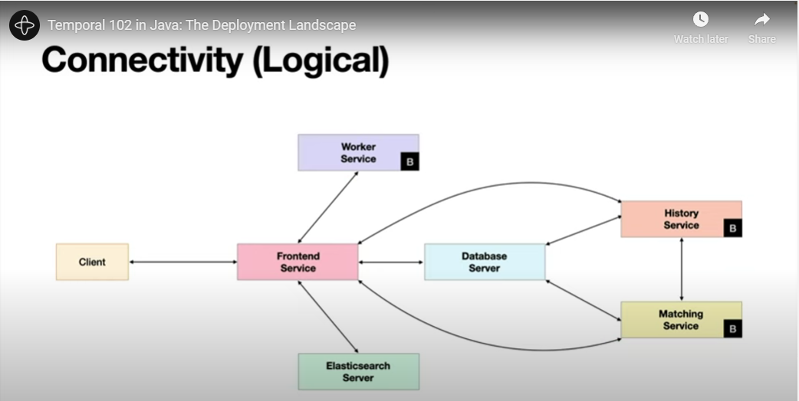

# Temporal 102

[Temporal 102](https://temporal.talentlms.com/learner/courseinfo/id:164): Durable Execution with Java

Repo: git clone https://github.com/temporalio/edu-102-java-code

Workflow - represents the sequence of steps used to carry out your business logic. MUst me deterministic.

Activity - represents the actual work that needs to be done and encapsulate non deterministic or unreliable code. Retried on failure.

Worker - is a process that executing workflow and activity code.

## Errors and Workflow Execution

### Activity Errors

If your Activity throws an exception, the Temporal Cluster will deem that execution attempt as failed. Every Activity is associated with a Retry Policy, either one you define or the default policy, which governs how any subsequent retries will be performed. It should be noted that while retrying an Activity is the default, there are ways to specify that a failed Activity should not be retried, such as by specifying one or more exception types in a call to the setDoNotRetry method when creating your RetryPolicy. If Activity execution fails with any of the exception you listed, it will not be retried.

When using the default Retry Policy, Temporal automatically retries the Activity using an exponential backoff. After the initial failure, it waits one second before the first retry, and if that attempt also fails, doubles this delay (up to a maximum of 100 seconds) during each subsequent attempt. It will continue retrying until execution of the Activity succeeds, is canceled, or times out.

You can change the retry behavior by specifying a custom Retry Policy (RetryOptions), and passing it to an ActivityOptions object. You will use this ActivityOptions object when registering your Activities to your Workflow. You can create multiple instances of your Activities using various RetryOptions, allowing you to execute activities with varying Retry Policies, giving you the flexibility needed to implement your business logic.

### Workflow Errors

In contrast, Workflows are not associated with a Retry Policy by default. Although it is possible to associate a Workflow Execution with a Retry Policy, it is unusual to do so. If a Workflow throws an exception, it will either be retried, or marked as failed. This is dependent on whether the exception is a Workflow Task Failure or a Workflow Execution Failure.

A Workflow Task Failure is an exception that is thrown when the Workflow code throws an exception that does not extend TemporalFailure. This will cause the Workflow to be retried. If you were to throw a custom or typical Java-based exception (example: IOError) in your Workflow this is the type of exception you would get.

A Workflow Execution Failure is an exception that is thrown when the Workflow code throws an exception that extends TemporalFailure or one of its child classes. Workflow Execution Failures put the Workflow Execution into the "Failed" state and no more attempts will be made in progressing this execution. If you are creating custom exceptions or raising typical Java-based exceptions you would either need to extend the TemporalFailure class or explicitly state that this exception is a Workflow Execution Failure by throwing a new ApplicationFailure.

Exceptions thrown by application code, like the ones shown above, are automatically converted into an language-neutral format by the Temporal Worker, ApplicationFailure. When the above activity throws the IOException, the Workflow will receive an ActivityFailure with an ApplicationFailure whose type will be java.io.IOException with the message and stack trace copied to it. It is important to note that the caller of this code would receive the resulting ApplicationFailure and not the original exception object.

## Backwards Compatible Input and Return Parameters

Another way that you can improve the Temporal application code that you write is by using classes to represent both the input parameters you pass to them and the results they return.

Workflows and Activities can accept any number of input parameters. In either case, changing the number, position, or type of these parameters will break backwards compatibility with existing executions.

For this reason, it is considered a best practice to encapsulate all input parameters into a single class, which is passed as input to the Workflow or Activity, rather than passing a series of individual parameters to these methods. This allows you to change the composition of the class without changing the signature of those methods. This is also the recommended approach for values returned from Workflows and Activities.

## Task Queue Names

Workers and workflows are associated with a task queue. The task queue is a logical grouping of workflows and activities. The task queue name is used to route workflows and activities to the appropriate worker. The task queue name is specified when the worker is created and when the workflow is started.

Since Task Queues are created dynamically when they are first used, a mismatch between these two values does not result in an error. Instead, it will result in the creation of two different Task Queues. Consequently, the Worker will not receive any tasks from the Temporal Cluster and the Workflow Execution will not progress. Therefore, we recommend that you define the Task Queue name in a constant that is referenced by the Client and Worker if possible, as this will ensure that they always use the same value.

## Multiple Workers

Finally, we recommend running at least two Worker Processes for each Task Queue in a production application, each running on a separate host.

This eliminates the Worker as a single point of failure, because if there are two Worker Processes and one of them crashes, the remaining Worker will recover any executions that were in progress and will continue to handle new ones, too. Running additional Worker Processes will further increase the scalability and availability of your application.

## Workflow Ids

Temporal guarantees that there can only be a single Workflow Execution with a given Workflow ID running within a Namespace at any point in time (a Namespace is a logical unit of isolation, often used to separate Workflows running on the same cluster but owned by different teams).

This constraint applies to Workflow Executions of any type within that Namespace, not just those of the same type. For example, an execution of the order processing Workflow cannot use the same Workflow ID currently used by a running execution of the loan management Workflow. This is an important consideration when choosing a Workflow ID value.

## Workflow ID Reuse Policy and Retention Period

Temporal allows you to further constrain the uniqueness of the Workflow ID within the Namespace by specifying a Workflow ID Reuse Policy when you start a Workflow. This policy allows for one of four options that govern whether the Workflow ID can be reused:

* WORKFLOW_ID_REUSE_POLICY_ALLOW_DUPLICATE
This is the default, which allows the Workflow ID to be reused by another Workflow Execution in the same Namespace upon the conclusion of the current one, regardless of whether that resulted in success or failure.
* WORKFLOW_ID_REUSE_POLICY_ALLOW_DUPLICATE_FAILED_ONLY
This policy is similar to the default, but only allows the Workflow ID to be reused if the Workflow Execution that used it did not complete successfully.
* WORKFLOW_ID_REUSE_POLICY_REJECT_DUPLICATE
This policy does not allow the Workflow ID to be reused at all, regardless of how the previous one ended.
* WORKFLOW_ID_REUSE_POLICY_TERMINATE_IF_RUNNING
This policy is similar to the default, with one important difference: It terminates the Workflow Execution currently using the specified Workflow ID, if there is one. This ensures that the new Workflow Execution will be the only one running in the Namespace with the specified Workflow ID.

```java
// Example: An order processing Workflow might include order number in the Workflow ID
WorkflowOptions options = WorkflowOptions.newBuilder()
        .setWorkflowId("example-workflow-id")
        .setTaskQueue(Constants.taskQueueName)
        .setWorkflowIdReusePolicy(
            WorkflowIdReusePolicy.WORKFLOW_ID_REUSE_POLICY_ALLOW_DUPLICATE_FAILED_ONLY)
        .build();

MyWorkflow workflow = client.newWorkflowStub(MyWorkflow.class, options);
// additional code would follow
```

## Workflow Execution Retention Period

One thing to keep in mind if you specify a more restrictive Workflow ID Reuse Policy is that Temporal can only enforce uniqueness based on the Workflow Executions for which it still has data. In order to maintain good performance and conserve storage space used by the cluster's database, data associated with past Workflow Executions is eventually deleted. This duration between when a Workflow Execution has finished and when it is eligible for automatic deletion is known as the Retention Period. It typically has a value between 1 and 30 days. Although it may be possible to specify a longer retention period if you're running a recent version of the Temporal Cluster software, this is generally discouraged because it can increase storage requirements and may diminish performance.

Some users are subject to compliance regulations or other requirements that mandate the ability to determine what took place during a Workflow Execution several months or even years after it concluded. Increasing the retention period may seem like an attractive solution for these use cases, but Temporal provides an alternative solution.

Self-hosted Temporal clusters provide the Archival feature. When Archival is enabled, data associated with a Workflow Execution is automatically copied to an appropriate long-term storage system (such as a local filesystem or Amazon S3) before being deleted after the Retention Period is reached.

Temporal Cloud provides a similar feature, known as Export. After Export is initially configured, it will export history data from your namespace to S3 on an hourly basis.

## Logging

Using a logging package makes it easier to follow your code's execution path at runtime. The Temporal Java SDK provides an slf4j compatible logging implementation that is safe to use in your code.

Why not use a third-party logging package directly in your code? Temporal provides durable execution of your Workflow, which it achieves through a process known as History Replay. You'll learn how this works later in the course, but the synopsis is that a Temporal Worker recovers the state of the Workflow by safely re-executing the Workflow Definition. By using Temporal's logging API, the Worker is able to suppress these log messages during replay so that log statements from the original execution aren't duplicated by the re-execution.

Add to pom.xml:

```xml
<dependency>
    <groupId>ch.qos.logback</groupId>
    <artifactId>logback-classic</artifactId>
    <version>1.4.8</version>
</dependency>
```

Add to src/main/resources/logback.xml:

```xml
<configuration>
    <appender name="STDOUT" class="ch.qos.logback.core.ConsoleAppender">
        <!-- encoders are assigned the type
             ch.qos.logback.classic.encoder.PatternLayoutEncoder by default -->
        <encoder>
            <!-- WorkflowId and ActivityId are keys populated by JavaSDK into MDC context -->
            <!-- See io.temporal.internal.logging.LoggerTag for a full list of keys -->
            <pattern>%d{HH:mm:ss.SSS} %-5level - %msg %n</pattern>
        </encoder>
    </appender>
    <logger name="io.grpc.netty" level="INFO"/>
    <root level="INFO">
        <appender-ref ref="STDOUT" />
    </root>
</configuration>
```

Using the logger:

```java
public static final Logger logger = Workflow.getLogger(TranslationWorkflowImpl.class);

logger.debug("Preparing to execute an Activity")
logger.info("Calculated cost of order. Tax {}, Total {}", tax, total)
```

## Accessing Results

Via synchronous execution by calling workflow or activity methods directly.

```java
MyWorkflow workflow = client.newWorkflowStub(MyWorkflow.class, options);
String result = workflow.myWorkflowMethod("input1", "input2");
```

Via asynchronous execution by using a completable future.

```java
import java.util.concurrent.CompletableFuture;
import io.temporal.client.WorkflowClient;

...
// Options defining code omitted for brevity
GreetingWorkflow workflow = client.newWorkflowStub(GreetingWorkflow.class, options);

// Workflow will be started at this point but the call doesn't block.
CompletableFuture<String> greeting = WorkflowClient.execute(workflow::greetSomeone, "World");

// This line will block, waiting on the result from the Workflow.
String result = greeting.get();
```

In most cases, the code that initiated the execution will eventually want to retrieve the result returned by that execution. Since those calls must return something immediately, yet the result won't be available until the execution is finished, the Java SDK returns a Promise that provides access to the result of an asynchronous execution. You will call get() to retrieve the value, which will block until the result becomes available at the end of execution.

```java
Promise<String> hello = Async.function(activities::greetInSpanish, name);
String result = hello.get();
```

If you need to execute several Activities independently from one another, then you may be able to significantly reduce the overall execution time of the Workflow by separating the execution requests from the retrieval of the results. Assuming that your Workers and the downstream systems used in your Activities have sufficient capacity, this will execute the Activities in parallel.

Example:

```java
Promise<String> hello = Async.function(activities::greetInSpanish, name);
Promise<String> goodbye = Async.function(activities::farewellInSpanish, name);
Promise<String> thanks = Async.function(activities::thankInSpanish, name);

// The following lines block until their respective executions have finished

String helloResult = hello.get();
String goodbyeResult = goodbye.get();
String thanksResult = thanks.get();
```

If each of the three Activities shown here runs for a similar length of time, then this approach would make the Workflow roughly three times faster than waiting to retrieve the results of one Activity before requesting execution of the next one.

This is a good strategy when a Workflow needs to call unrelated Activities.

## Timers

Durable Timers are one of the features provided by Temporal and are used to introduce delays in a Workflow Execution. When a Timer is set, the execution of code awaiting that timer will block until the Timer fires. Timers are maintained by the Temporal Cluster and the Worker does not consume resources while awaiting them.

The duration of a Timer is fixed and can range from one second to several years. Although it is possible to specify a duration of less than one second, you should avoid doing so because the networking latency involved with roundtrips between the Worker and Temporal Cluster will affect the precision of Timers with sub-second durations.

There are several reasons that you might want to introduce delays in a Workflow Execution.

One is that your business logic dictates that you execute an Activity at fixed intervals. For example, a Workflow used for customer onboarding might send e-mail reminders one day, one week, and/or one month after they sign up.

Another is that you need to execute an Activity multiple times at intervals that are dynamically calculated. In this case, you might delay calling one Activity based on the value returned by a previous Activity.

Yet another reason is that you need to allow time for offline steps to complete before proceeding. For example, a business process may require a fixed period of time to elapse before the next task can begin.

### Pausing a Workflow Execution for a Specified Duration

Use the Workflow.sleep function if you need to pause further execution of the Workflow for a specific duration:

```java
import java.time.Duration;
import io.temporal.workflow.Workflow;

// This will pause Workflow Execution for 10 seconds
Workflow.sleep(Duration.ofSeconds(10));
```

This is a Workflow-safe replacement for Java's Thread.sleep method and takes one input parameters, the duration for which to sleep. Calling this method blocks until the Timer fires (or is canceled).

### Running Code at a Specific Time in the Future

Use the Workflow.newTimer method if you need to run code at a specific point in the future.

```java
import java.time.Duration;
import io.temporal.workflow.Workflow;

// Workflow.newTimer is a Workflow-safe counterpart to java.util.Timer
Promise timerPromise = Workflow.newTimer(Duration.ofSeconds(30))
logger.info("The timer was set")

// Unlike Workflow.sleep, waiting for the timer is a separate operation
timerPromise.get()
logger.Info("The timer has fired")
```

This is a Workflow-safe replacement for Java's java.util.Timer class. It takes the duration to wait as a parameter, the same two input parameters as Workflow.sleep, but unlike that method, calling it does not block after setting the Timer. Instead, it returns a Promise, which becomes ready when the Timer fires (or is canceled). Waiting on that Promise will block until it becomes ready.

### Timers and Crashes

Timers are durable and are maintained by the Temporal Cluster. When the Worker encounters either a Workflow.sleep or Workflow.newTimer call in the Workflow code, it submits a request to the cluster, asking it to start a Timer for the specified duration. When the Timer fires, the cluster adds a new Workflow Task to the Task Queue, after which the Worker resumes execution of the Workflow.

Be sure to note that the cluster fires the Timer after the specified duration, regardless of whether or not any Workers happen to be running at the time.

To better understand the behavior of a Timer in the event of a Worker crash, consider the following scenario: Your Workflow code uses Workflow.sleep to set a Timer for 10 seconds and you have a single Worker process, which happens to crash 3 seconds later.

If you restart the Worker process 2 seconds later, then Workflow Execution will pause for the remaining 5 seconds of the Timer, and it will be as if it had never crashed at all
However, if you started it 20 minutes later, then the Timer will have already fired, and the Worker will resume execution of the remaining Workflow code without additional delay
Since Timers are maintained by the Temporal Cluster, they fire regardless of whether any Workers are running. However, as suggested by the second bullet point, Workers can experience potentially long outages, whether due to a crash or system maintenance. Therefore, Workflow code should be robust to account for the possibility that a Timer takes longer than the specified duration.

## Workflow Execution

Two states - open and closed
Run id - generated when a workflow execution is launched

Variations on closed:

* Completed - the workflow execution has finished successfully
* Continued As New - the workflow execution has been replaced by a new one
* Canceled - the workflow execution was canceled
* Failed - the workflow execution has failed
* Terminated - the workflow execution was terminated
* Timed Out - the workflow execution has timed out

## Workflow Code

A workflow is a sequence of steps. Some of those steps are internal to the workflow, e.g. do not requre interaction with the cluster

* setting config parameters
* performing calculations
* evaluating variables or expressions
* populating data structures

Steps that Interact with the cluster

* Creating an activity
* Workflow.sleep
* Throwing an application failure exception

## Event History

Every Workflow Execution has an Event History associated with it, which represents the single source of truth for what transpired during that execution. Since the Temporal Cluster maintains this history, appending new Events based on requests from Clients and Workers, this history represents the Temporal Cluster's perspective about what happened during Workflow Execution.

Event Histories are persisted to the database used by the Temporal Cluster, so they're durable, and will even survive a crash of the Temporal Cluster itself. This is an important property, because Event Histories serve two key purposes in Temporal. First, they are essential for Temporal to provide its guarantee of durable execution, because Events in the history are used to reconstruct the state of a Workflow Execution following a Worker crash. Second, history information enables developers to investigate Workflow Executions. This is one of the benefits of using Temporal. Not only can you trace the steps followed during the execution of the code that's currently running, you can also review the steps for code that ran in the past, so you'll have insight well beyond what's available in a traditional application.

The Event History acts as an ordered append-only log of Events.

### Protecting confidential information

In order to recreate the state of a Workflow following a crash, they store the Event History associated with the execution, which includes values passed as input and returned as output from both Workflows and Activities. In some cases, these may contain confidential information, such as medical or financial data. Temporal supports the use of TLS (Transport Layer Security) to protect this data as it is transmitted between a Client and Frontend, as well as between different services within the Temporal Cluster. However, a common question asked by people new to Temporal is how to protect confidential data stored by the Temporal Cluster.

Although storing this data is critical to how Temporal operates, it’s actually the Workers that interpret it. Applications can protect the confidentiality of this information by creating a custom Data Encoder that encrypts data as it’s sent to the Temporal Cluster or Temporal Cloud, so that it’s stored in encrypted form. The Data Encoder will then decrypt the information it receives from Temporal Cluster or Cloud, thereby ensuring that it’s only readable within the application itself.


### Event History Limits

Event Count:

The Temporal Cluster begins logging warnings after 10K (10,240) events and will log additional warnings as new Events are appended to the history. If the Event History exceeds 50K (51,200) Events, the Workflow Execution may be terminated.

Event History Size:

Recall that input parameters and output values of both Workflows and Activities are stored in the Event History. Storing large amounts of data can lead to performance problems, so the Temporal Cluster limits both the size of the Event History and values stored within it.

A Workflow Execution may be terminated if the size of any payload (i.e., the input passed into, or the result returned by, an Activity or Workflow) exceeds 2 MB or if the entire Event History exceeds 50 MB.

To avoid hitting these limits, it's considered a best practice to avoid passing large amounts of data into and out of Workflows and Activities. A popular way of dealing with this is by using the Claim Check pattern, which is widely used with messaging systems such as Apache Kafka. Instead of passing a large amount of data into your function, you store that data external to Temporal, perhaps in a database or object storage. You would then pass the identifier for the data, such as the primary key or file path, into the function, and use an Activity to retrieve it as needed. If your Activity produces a large amount of data, you could use a similar approach, writing that data to an external system and returning as output an identifier that could subsequently be used to retrieve it.

## Commands to Event Mapping

* ScheduleActivityTask -> ActivityTaskScheduled
* Worker picks up activity -> ActivityTaskStarted
* Completed notification -> ActivityTaskCompleted
* Workflow.sleep -> StartTimer -> TimerStarted
* Timer fired -> TimerFired

Activity task events:

1. ActivityTaskScheduled
2. ActivtyTaskStarted
3. ActivityTaskCompleted or ActivityTaskFailed or ActivityTaskTimedOut or ActivityTaskCanceled


Workflow task events:

1. WorkflowTaskScheduled
2. WorkflowTaskStarted
3. WorkflowTaskCompleted or WorkflowTaskFailed or WorkflowTaskTimedOut

### Workflow Task Stickiness

Workers cache the state of the Workflow they execute. To make this caching more effective, Temporal employs a performance optimization known as "Sticky Execution," which directs Workflow Tasks to the same Worker that accepted them earlier in the same Workflow Execution.

## History Replay

Temporal provides developers with a valuable guarantee. The code you write will be durable, executing reliably despite underlying conditions that would cause most other programs to fail. The process might crash, the server running the code might be rebooted during system maintenance, or a service you call may temporarily go offline. None of these are an obstacle for a Workflow, and with Temporal, you code as if they weren't even possible.

If a regular method in Java crashes during execution, all of its state is lost. It can't be resumed, only restarted. From the developer's perspective, a Temporal Workflow resumes its execution at the point where the crash occurred, with all previous state intact, and continues on from there. Since you've already seen and run several Workflows, you might wonder how it's able to achieve this, since there's no obvious checkpointing or state management in the code.

History Replay, sometimes also called Workflow Replay, is the mechanism that Temporal uses to reconstruct the state of a Workflow Execution. The following video explains how it works.

## Why is Determinism Needed?

In Temporal 101, we explained this by saying that it must produce the same output each time, given the same input. This explanation was sufficient for that point in your journey to learn Temporal, but you now know enough about Workflow Execution to understand the precise definition.

A Workflow is deterministic if every execution of its Workflow Definition produces the same Commands, in the same sequence, given the same input.

Why does Temporal require determinism for Workflows? The answer is that Temporal's ability to guarantee durable execution of your Workflow depends on it.

### Common Sources of Non-Determinism

* Using random numbers
* Accessing / Mutating External Systems or State
    * Aside from calling Temporal APIs, your Workflow code should not access or mutate anything external to it. This includes global state, but also databases, file systems, input or output streams, and network services. If the business logic of your Workflow requires interaction with such external systems, perform them from an Activity used by your Workflow.
* Relying on system time
* Working directly with threads
* Iterating over data structures with unknown ordering
    * e.g. java hashmaps (order is not guaranteed), go maps (order is not guaranteed)
* Storing or evaluating the run id

## Workflow Changes Leading to Non-Deterministic Errors

Deploying modifications to a Workflow Definition can also lead to non-deterministic errors, even if the changes don't involve things, such as random numbers or system time, that are disallowed in Workflow code. These occur when the state of a Workflow Execution that was running when the change was deployed cannot be reconstructed using the updated version of the code.

You can assess whether a given change could lead to non-deterministic errors by considering the definition of determinism provided earlier in the course. If it's possible that executing the modified code with a given input would not lead to exactly the same Commands—in the same sequence—as the original code, then deploying the change may lead to a non-deterministic error.

This wording is important. We say may lead to, rather than will lead to, because such a change has the potential to cause a non-deterministic error, but whether or not it actually does depends on whether or not there were any executions of that Workflow Type running at the time the change is deployed.

Recall that Workers cache application state, so you must restart them after deploying the updated code. Once the Workers have been restarted, they will replay all Workflow Executions currently in progress using that code, If any of these executions yields a different sequence of Commands using the new version than they did with the previous version, it will result in a non-deterministic error. You are most likely to encounter this with long-running Workflows, since there's probably one or more executions already in progress any time that you might need to deploy a change.

Examples of Changes That May Lead to Non-Deterministic Errors

* Adding or removing an Activity
* Switching the Activity Type used in a call to an Activity Method
* Adding or removing a Timer
* Altering the execution order of Activities or Timers relative to one another

Examples of Changes That Do Not Lead to Non-Deterministic Errors

* Modifying statements in a Workflow Definition, such as logging statements, that do not affect the Commands generated during Workflow Execution
* Changing attributes in a ActivityOptions or RetryPolicy
* Modifying code inside of an Activity Definition


### Workflow Reset

Restart a workflow from a specific point - from the ui or command line

Only Events that took place before the reset point are carried over into the new execution, while anything after that point will be run again, regardless of whether it had already completed successfully. Therefore, even though the Timer had already fired, it will be started again in the new execution because the TimerStarted Event occurred after the reset point.

When resetting the Workflow, you can—and should—specify a reason for resetting it. This becomes part of the Event History for both the original and new executions, and provides helpful information for someone who later needs to know why the Workflow was reset.

After resetting the Workflow, the current execution is terminated, and the reason specified is shown in the WorkflowExecutionTerminated Event. The Web UI provides a link to the new execution created as a result of the reset. This contains a WorkflowTaskFailed Event, which corresponds to the reset point and includes the reason I specified. The subsequent Workflow Task completed, and as the Workflow Execution progressed beyond the reset point, it reached the Timer. After the Timer fires, the final Activity runs and the Workflow Execution completes successfully.

```bash
$ temporal workflow reset \
        --workflow-id pizza-workflow-order-XD001 \
        --event-id 4 \
        --reason "Deployed an incompatible change (deleted Activity)"
```


## Terminating a Workflow

Via the UI or the command line

```bash
temporal workflow terminate \
    --workflow-id process-invoice-82461092
    --reason "Invalid input data provided when starting the Workflow"
```

It can also be terminated using code:

```java
import io.temporal.client.WorkflowClient;
import io.temporal.client.WorkflowOptions;
import io.temporal.serviceclient.WorkflowServiceStubs;
import io.temporal.client.WorkflowStub;

public class Terminator {

  public static void main(String[] args) throws Exception {
    String workflowId = "pizza-workflow-order-XD001";

    WorkflowServiceStubs service = WorkflowServiceStubs.newLocalServiceStubs();
    WorkflowClient client = WorkflowClient.newInstance(service);

    PizzaWorkflow workflow = client.newWorkflowStub(PizzaWorkflow.class, workflowId);
    WorkflowStub stub = WorkflowStub.fromTyped(workflow);

    stub.terminate("Invalid input data provided when starting the Workflow");
    System.exit(0);
  }
}

```

## Scaling Deployments

Services

* Frontend service - an API gateway that validates and routes incoming calls
* History service - maintains history and moves execution progress forward
* Matching service - hosts task queues and matches wokers with tasks
* Worker service - runs internal workflows (replication, archiving, etc), not exposed to users.

Can run multiples of these. Load balancers are used for multiple front end services.

Each service can be scaled independently.



ElasticSearch is optional but recommended for searching and sql queries